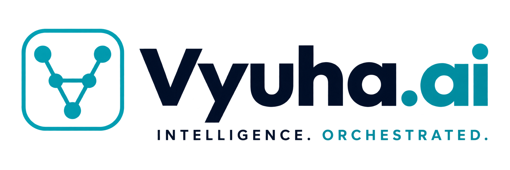
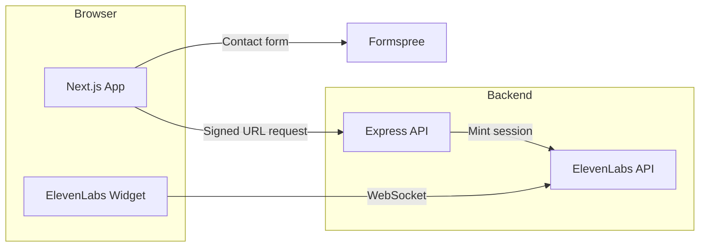

<div align="center">



# Vyuha.ai Marketing Site

**Sovereign Agentic AI for the Enterprise**

One platform. Infinite autonomous outcomes — built for Cybersecurity, IT, FinOps, and Business Operations leaders who need deep enterprise context under uncompromising governance.

<br />

[](https://www.vyuha.ai)
[](https://nextjs.org)
[](https://react.dev)
[](https://www.typescriptlang.org)
[](https://tailwindcss.com)
[](https://nodejs.org)

</div>

---

## Overview

This repository powers the public marketing experience for **[Vyuha.ai](https://www.vyuha.ai)** — a cinematic, content-driven site with rich motion design, enterprise SEO, AI discovery endpoints, and an optional Express backend for secure ElevenLabs Convai integration.

The frontend is a **Next.js App Router** application with marketing pages driven by typed content modules. The backend is a small **Express** service that mints short-lived signed URLs for private voice agents without exposing API keys to the browser.



---

## Highlights

| Area | What you get |
| --- | --- |
| **Experience** | Particle hero, WebGL effects, Lenis smooth scroll, GSAP / Framer Motion, view transitions |
| **Content** | Typed content modules under `src/content/` — copy changes without touching layout code |
| **SEO** | Metadata, Open Graph images, JSON-LD, sitemap, robots, canonical URLs |
| **AI discovery** | `/llms.txt` and `/llms-full.txt` routes for LLM crawlers and assistants |
| **Security** | CSP, HSTS, rate limiting, safe external links, hardened error handling |
| **Voice AI** | Self-hosted ElevenLabs Convai widget with backend-signed session URLs |
| **Contact** | Formspree-powered lead capture on `/contact` |

---

## Project structure

```
vyuha-particle/
├── src/
│   ├── app/                    # Next.js App Router (pages, layouts, metadata routes)
│   │   ├── (marketing)/        # Marketing site pages
│   │   ├── llms.txt/           # AI crawler summary
│   │   ├── llms-full.txt/      # Extended AI-readable site map
│   │   ├── sitemap.ts
│   │   └── robots.ts
│   ├── components/             # UI, sections, marketing views, hero effects
│   ├── content/                # Page copy and structured content
│   └── lib/                    # SEO, sitemap, AI discovery, utilities
├── backend/                    # Express API for ElevenLabs signed URLs
├── public/                     # Static assets, leadership photos, vendor scripts
├── scripts/                    # Build-time asset vendoring
└── vercel.json
```

### Marketing routes

| Route | Purpose |
| --- | --- |
| `/` | Home — hero, platform narrative, CTAs |
| `/platform` | Platform overview |
| `/platform/command` | Agentic apps |
| `/platform/in-a-box` | Edge deployment offering |
| `/platform/integrations` | Connectors and ecosystem |
| `/solutions/*` | IT, security, business ops, industry use cases |
| `/company` | About and leadership |
| `/partners` | Partner ecosystem |
| `/contact` | Demo and architecture sprint requests |
| `/resources/*` | Blog and news & events |

---

## Getting started

### Prerequisites

- **Node.js 22.x**
- **npm** (or your preferred package manager)

### 1. Install and run the frontend

```bash
npm install
npm run dev
```

Open **[http://localhost:3000](http://localhost:3000)**.

The dev server binds to `0.0.0.0` so you can preview from other devices on your LAN.

### 2. Optional — run the backend

The voice widget works standalone; the backend is only required if you need server-minted signed URLs for a private ElevenLabs agent.

```bash
cd backend
npm install
cp .env.example .env   # create and fill in values (see below)
npm run dev
```

Backend defaults to **[http://127.0.0.1:4000](http://127.0.0.1:4000)**.

---

## Environment variables

### Frontend (`.env.local`)

| Variable | Required | Description |
| --- | --- | --- |
| `NEXT_PUBLIC_SITE_URL` | Recommended | Canonical site URL for metadata and JSON-LD (e.g. `https://www.vyuha.ai`) |

Vercel automatically provides `VERCEL_URL` and `VERCEL_PROJECT_PRODUCTION_URL` when deployed.

### Backend (`backend/.env`)

| Variable | Required | Description |
| --- | --- | --- |
| `ELEVENLABS_AGENT_ID` | Yes | Private Convai agent ID |
| `ELEVENLABS_API_KEY` | Yes | ElevenLabs API key |
| `SIGNED_URL_SECRET` | Yes | Bearer / `X-Api-Key` secret clients must send to `/api/signed-url` |
| `CORS_ORIGINS` | No | Comma-separated allowed origins (default: `http://localhost:3000`) |
| `PORT` | No | Server port (default: `4000`) |
| `HOST` | No | Bind address (default: `127.0.0.1`) |

---

## Scripts

### Frontend

| Command | Description |
| --- | --- |
| `npm run dev` | Start Next.js dev server |
| `npm run build` | Production build (vendors ElevenLabs widget first) |
| `npm run start` | Serve production build |
| `npm run lint` | Run ESLint |
| `npm run vendor:elevenlabs` | Copy pinned Convai widget to `public/vendor/` |

### Backend

| Command | Description |
| --- | --- |
| `npm run dev` | Start Express with hot reload |
| `npm run start` | Start Express in production |
| `npm run typecheck` | TypeScript check without emit |

---

## Content workflow

Marketing copy lives in **`src/content/`** as typed TypeScript modules. To update a page:

1. Edit the relevant file in `src/content/` (e.g. `home.ts`, `contact.ts`, `solutions/overview.ts`).
2. Save — Next.js hot-reloads in dev.
3. Page components in `src/app/(marketing)/` import and render that content.

This keeps layout, motion, and copy separate so non-engineers can safely update text with minimal risk.

---

## Security

The site is hardened for production:

- **Content Security Policy** with strict defaults and ElevenLabs / Formspree allowlists
- **HSTS**, `X-Frame-Options`, `Referrer-Policy`, and `Permissions-Policy` headers
- **Rate limiting** on the Express API (global, health, and signed-url endpoints)
- **Timing-safe** secret comparison for backend auth
- **Safe external links** — only `http:` / `https:` hrefs render as anchors
- **JSON-LD** serialized without `dangerouslySetInnerHTML`

---

## Deployment

### Frontend — Vercel

The app is configured for **[Vercel](https://vercel.com)** (`vercel.json` sets `framework: nextjs`).

1. Connect this repository to Vercel.
2. Set `NEXT_PUBLIC_SITE_URL` to your production domain.
3. Deploy — `npm run build` runs automatically.

### Backend

Deploy `backend/` to any Node 22 host (Railway, Fly.io, Render, etc.). Set all backend env vars and point `CORS_ORIGINS` at your production frontend URL.

---

## Tech stack

**Frontend:** Next.js 16 · React 19 · TypeScript · Tailwind CSS 4 · GSAP · Framer Motion · Lenis · Three.js / OGL · Lucide React · Formspree

**Backend:** Express · CORS · express-rate-limit · dotenv · tsx

---

## Contributing

1. Create a feature branch from `main`.
2. Make focused changes — content edits belong in `src/content/`, not inline in page components.
3. Run `npm run lint` and `npm run build` before opening a PR.
4. For backend changes, run `npm run typecheck` inside `backend/`.

---

<div align="center">

**[vyuha.ai](https://www.vyuha.ai)** · Enterprise agentic intelligence inside your private perimeter

<br />

Questions or demo requests? Visit **[/contact](https://www.vyuha.ai/contact)** or email **Sales@Vyuha.ai**

</div>
